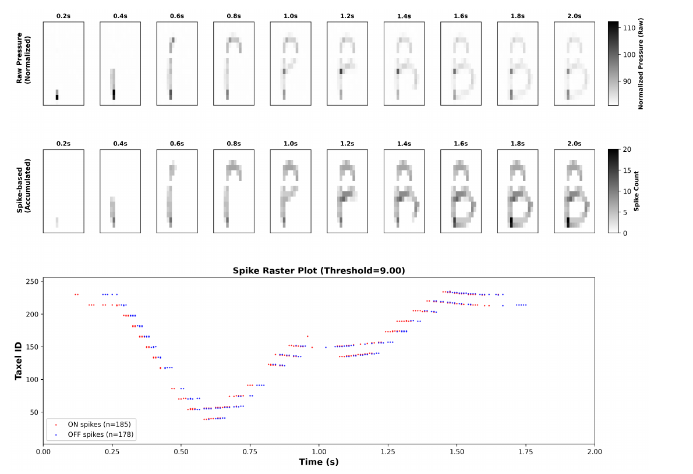

# STEMNIST 原始论文总结与注释整理

> 论文：*STEMNIST: Spiking Tactile Extended MNIST Neuromorphic Dataset*  
> 作者：Anubhab Tripathi, Li Gaishan, Zhengnan Fu, Chiara Bartolozzi, Bert E. Shi, Arindam Basu  
> 版本：arXiv:2601.01658v1，2026-01-04  
> 原文：[STEMNIST_2601.01658v1.pdf](./STEMNIST_2601.01658v1.pdf)

## 一、论文概览

STEMNIST 是一个面向神经形态触觉识别的字母数字数据集。论文将早期 ST-MNIST 的 10 类数字识别扩展到 35 类字符，包括 26 个大写英文字母 A-Z 和 9 个数字 1-9。数据由 34 名参与者使用食指在 16×16 柔性压阻触觉阵列上书写获得。

论文的核心贡献不是提出新的 SNN 学习算法，而是：

1. 建立具有真实书写时间过程的触觉数据集；
2. 同时提供原始压力帧和稀疏 ON/OFF 脉冲事件；
3. 建立参数量一致的 CNN 与 SNN 分类基线；
4. 为触觉识别、神经形态硬件和时空学习算法提供标准化测试平台。

### 关键数据

| 项目 | 数值 |
|---|---:|
| 类别数 | 35 类：A-Z、1-9 |
| 参与者 | 34 人 |
| 每类样本 | 220 |
| 总样本数 | 7,700 |
| 单个样本时长 | 2 秒 |
| 采样率 | 120 Hz |
| 单个样本帧数 | 240 |
| 触觉阵列 | 16×16，共 256 个 taxel |
| 单个原始样本形状 | 240×16×16 |
| 原始帧总数 | 1,848,000 |
| 脉冲事件总数 | 1,005,592 |
| CNN 最终测试准确率 | 90.91% |
| SNN 最终测试准确率 | 89.16% |

---

## Annotation 1：论文主要内容

论文建立了一个包含 35 类字母数字、保留真实书写时间过程的神经形态触觉数据集，并给出约 90% 准确率的 CNN/SNN 基线。

与 MNIST、EMNIST 只保存最终图像不同，STEMNIST 记录的是手指在触觉阵列上书写时不断变化的压力分布。因此，数据不仅包含字符的空间形状，也包含：

- 笔画先后顺序；
- 手指移动速度；
- 笔画间的停顿；
- 按压和释放过程；
- 书写力度；
- 不同书写者的空间位置、大小和方向差异。

论文希望弥补现有神经形态触觉数据集类别少、空间分辨率低、时间采样不足的问题，并提供适合传统神经网络、SNN 和神经形态硬件共同评测的数据基础。

---

## Annotation 2：论文的核心问题

### 2.1 为什么传统 MNIST/EMNIST 不适合研究真实时间动态

MNIST 和 EMNIST 是静态图像数据集。它们只保存书写完成后的字符形状，不包含字符形成的动态过程。因此无法研究笔画顺序、速度、压力和停顿等时序因素。

### 2.2 现有神经形态视觉数据集的问题

N-MNIST 和 MNIST-DVS 虽然提供事件流，但其事件通常由事件相机观察静态图片并进行人工眼跳或移动产生。时间结构来自相机运动，而不是被识别对象本身。

已有研究发现，对 N-MNIST 等数据进行时间压缩后，普通帧式神经网络仍能达到与 SNN 相当甚至更高的准确率。这说明此类数据的判别信息可能主要存在于空间形状中，未必需要精确的事件时间。

### 2.3 为什么选择触觉书写

触觉书写的时间结构天然来自物理交互：

- 手指移动形成连续轨迹；
- 不同笔画有真实先后关系；
- 速度和接触压力随时间变化；
- 压力增加和减小可分别编码为 ON/OFF 事件；
- 数据不需要从静态图像人工制造时间维度。

因此，STEMNIST 的核心研究问题是：

> 能否建立一个规模更大、类别更多、保留自然时空动态的触觉事件数据集，用于评估 CNN、SNN 和其他时序学习方法？

需要注意的是，论文证明了 STEMNIST 可以支持高准确率分类，但尚未充分证明精确时间信息对于分类是不可替代的，因为**静态累积输入的 CNN 仍略优于 SNN。**

---

## Annotation 3：数据采集硬件系统

系统由三个部分组成：

1. **16×16 柔性压阻触觉阵列**
   - 共 256 个 taxel；
   - 单个感知单元约为 7.5 mm×7.5 mm；
   - 阵列位于约 150 mm×150 mm 的区域；
   - 压力越大，传感器电阻越小；
   - 测试范围内，电阻由数 GΩ 单调下降至约 3 kΩ。

2. **模拟前端、ADC 与 FPGA**
   - 使用 ADG734 开关芯片选择阵列行；
   - 使用 OPA2991 运算放大器构成反馈读取电路；
   - 反馈电阻 \(R_f=100\text{ k}\Omega\)；
   - 使用 ADS7961 16 通道 ADC；
   - FPGA 负责阵列扫描、LED 控制、数据接收和传输。

3. **计算机端采集程序**
   - 使用 Python GUI 同步 LED 时序与串口数据；
   - 实时校验帧标记；
   - 将连续采集数据保存为 HDF5 文件；
   - 后处理程序再将五字符记录切分为单字符样本。

整体流程为：

```text
手指书写
   ↓
16×16 压阻触觉阵列
   ↓
模拟前端与 ADC
   ↓
FPGA 扫描、定时与传输
   ↓
计算机保存原始 HDF5 数据
   ↓
差分阈值编码生成 ON/OFF 脉冲
```

---

## Annotation 4：数据采集过程与原始数据形式

### 4.1 采集协议

34 名参与者使用食指直接在传感器表面书写字符。每个字符的时间安排为：

- LED 亮起 2 秒：书写并采集；
- LED 熄灭 1 秒：准备下一个字符；
- 采样率为 120 Hz；
- 每个字符样本包含 \(2\times120=240\) 帧。

35 个字符被分成 7 组，每组 5 个：

| 组别 | 字符 |
|---|---|
| Set 1 | A-E |
| Set 2 | F-J |
| Set 3 | K-O |
| Set 4 | P-T |
| Set 5 | U-Y |
| Set 6 | Z、1-4 |
| Set 7 | 5-9 |

前 10 名参与者每个字符重复 10 次，其余 24 名参与者每个字符重复 5 次。因此每类样本数为：

\[
10\times10+24\times5=220
\]

总样本数为：

\[
220\times35=7700
\]

所有类别均包含 220 个样本，类别完全平衡。

### 4.2 原始数据形式

每个样本由 240 帧 16×16 压力数据组成：

\[
240\times16\times16
\]

因此单个样本包含：

\[
240\times16\times16=61,440
\]

个 8 位压力测量值。

整个数据集的原始帧数为：

\[
7700\times240=1,848,000
\]

实际 ADC 数值主要位于 75-255：

- 约 75：无压力或接近基线；
- 接近 255：较强接触压力。

每个原始单字符样本保存为 HDF5 文件，并包含参与者编号、字符标签、重复次数、采样频率、阵列尺寸和采集时间等元数据。论文给出的命名形式为：

```text
<ParticipantID>_<Character>_<RepetitionNumber>.h5
```

---

## Annotation 5：脉冲数据生成方法

STEMNIST 的传感器首先同步采集 120 Hz 压力帧，之后通过相邻帧差分离线生成事件。因此，它是由帧数据转换得到的事件式表示，并非传感器直接输出的原生异步事件。

### 5.1 时间差分

对每个 taxel 计算相邻帧压力差：

\[
\Delta P(f,x,y)=P(f,x,y)-P(f-1,x,y)
\]

其中：

- \(f\)：帧编号；
- \((x,y)\)：16×16 阵列上的 taxel 坐标；
- \(\Delta P>0\)：压力增加；
- \(\Delta P<0\)：压力减小。

### 5.2 每个样本独立计算自适应阈值

不同参与者的书写力度差异较大，因此论文不使用统一全局阈值，而是对每个样本执行：

1. 计算所有非零的 \(|\Delta P|\)；
2. 取这些数值的第 90 百分位数；
3. 将最终阈值的下限设为 4。

\[
\theta_{\text{sample}}
=
\max\left(
P_{90}\left(\{|\Delta P|:|\Delta P|\neq0\}\right),
4
\right)
\]

零差分不参与统计，因为大部分 taxel 在大部分时间没有压力变化。若包含大量零值，阈值会主要反映背景静止状态，而不能反映有效笔画的压力变化。

全数据集的样本阈值统计为：

\[
\theta=7.77\pm4.44
\]

### 5.3 ON/OFF 事件规则

\[
\operatorname{Spike}(f,x,y)=
\begin{cases}
+1, & \Delta P(f,x,y)>\theta \\
-1, & \Delta P(f,x,y)<-\theta \\
0, & \text{其他情况}
\end{cases}
\]

- ON 事件 \(+1\)：压力显著增加；
- OFF 事件 \(-1\)：压力显著减小；
- 0：变化不足以超过阈值。

### 5.4 AER 事件格式

每个事件表示为：

\[
(timestamp,\ taxel\ ID,\ polarity)
\]

其中：

- 时间戳 \(timestamp=f/120\)，单位为秒；
- taxel ID 范围为 1-256；
- polarity 为 \(+1\) 或 \(-1\)。

处理后的脉冲文件还保存事件总数、自适应阈值以及对应原始文件的引用。论文给出的命名形式为：

```text
<ParticipantID>_<Character>_<RepetitionNumber>_spikes.h5
```

### 5.5 Figure 5：字母 B 从原始压力帧到累积脉冲的形成过程

> 本轮补充注释（Annotation 1）：原始压力图与累积脉冲图，附图。

Figure 5 位于原论文第 14 页，是全文最重要的数据示例图。它以一个字母 B 的样本为例，同时展示原始压力、累积事件空间图和脉冲时间序列之间的关系。



图中包含三个部分：

1. **第一行：累积原始压力图**
   - 从 0.2 秒到 2.0 秒，每隔 0.2 秒显示一次书写进度；
   - 图像是截至对应时刻累积的压力结果，并非单个瞬时压力帧；
   - 灰度越深，表示该位置累积的原始压力越大；
   - 可以看到竖直笔画先形成，随后依次形成 B 的上部和下部弧线。

2. **第二行：累积脉冲图**
   - 将截至对应时刻出现的 ON 和 OFF 事件按 taxel 位置累加；
   - 灰度表示累计事件数量，色条范围约为 0-20；
   - 与原始压力图相比，它去除了大量没有明显压力变化的背景位置；
   - 尽管表示更稀疏，仍能恢复出完整的字母 B，说明差分阈值编码保留了主要空间轨迹。

3. **第三部分：脉冲栅格图**
   - 横轴为 0-2 秒的书写时间，纵轴为 1-256 的 taxel ID；
   - 红点表示 ON 事件，共 185 个；
   - 蓝点表示 OFF 事件，共 178 个；
   - 该样本的自适应阈值为 9.0；
   - 不同时间段形成的事件簇对应竖线、上部弧线和下部弧线等连续笔画阶段。

这张图说明，STEMNIST 的脉冲数据不仅保留最终字符的空间形状，还保留字符如何随时间逐笔形成的信息。需要特别注意：前两行采用的是“截至当前时刻的累积结果”，因此后一个时间点包含此前已经出现的压力或事件，不能将其理解为彼此独立的瞬时快照。

---

## Annotation 6：稀疏事件编码效果

数据集包含：

- 总事件数：1,005,592；
- ON 事件：498,230；
- OFF 事件：507,362；
- 每个样本平均事件数：130.60；
- 每个样本平均 ON 事件：64.7；
- 每个样本平均 OFF 事件：65.9。

按单个原始样本的 \(240\times16\times16=61,440\) 个时空位置估算：

\[
\text{事件占比}
\approx
\frac{130.60}{61,440}
\times100\%
\approx0.21\%
\]

这意味着约 99.79% 的时空位置不产生事件，编码结果高度稀疏。

稀疏编码的意义包括：

- 减少需要存储和传输的数据量；
- 适合事件驱动计算；
- 可避免持续处理大量无变化的背景 taxel；
- 为神经形态硬件的低功耗推理提供基础。

但 0.21% 是基于原始帧张量大小计算的近似比例；事件是通过相邻帧差分和阈值筛选产生的，不能简单等同于实际硬件上的能耗降低比例。

---

## Annotation 7：CNN 与 SNN 的输入数据形式和网络结构

### 7.1 CNN 输入

CNN 不直接处理事件时间序列，而是将完整 2 秒内的事件沿时间维累积为两个 16×16 通道：

- 通道 0：每个 taxel 的 ON 事件计数；
- 通道 1：每个 taxel 的 OFF 事件计数。

因此 CNN 输入为：

\[
2\times16\times16
\]

这种表示保留事件的空间位置和极性，但丢失笔画顺序及事件精确时间。

### 7.2 CNN 结构

```text
输入：2×16×16
  ↓
Conv1：8 个 4×4 卷积核，stride=1，无 padding
  ↓
ReLU
  ↓
2×2 MaxPool
  ↓
Conv2：16 个 3×3 卷积核，stride=1，padding=1
  ↓
ReLU
  ↓
2×2 MaxPool
  ↓
展平：16×3×3 = 144
  ↓
Dropout：0.3
  ↓
全连接：144→35
```

总参数量为 6,507。

### 7.3 SNN 输入

SNN 保留时间维度，将 2 秒事件流分成 20 个时间步：

\[
2\text{ s}/20=100\text{ ms}
\]

每个时间步包含相应时间窗内的 ON/OFF 空间事件图。网络按时间步依次处理输入，并更新 LIF 神经元膜电位。

### 7.4 SNN 结构

SNN 与 CNN 具有相同的卷积拓扑和参数量，但使用 LIF 神经元代替 ReLU：

```text
20 个时间步的 ON/OFF 事件图
  ↓
Conv1 → LIF(β=0.9) → MaxPool
  ↓
Conv2 → LIF(β=0.9) → MaxPool
  ↓
Dropout(0.3)
  ↓
全连接 → 输出 LIF
  ↓
累加 20 个时间步的输出脉冲数
  ↓
发放率编码分类
```

训练配置：

- 框架：PyTorch 2.0、snnTorch；
- 优化器：Adam；
- 损失：交叉熵；
- 代理梯度：ATan；
- 膜电位衰减：\(\beta=0.9\)；
- 权重衰减：\(10^{-4}\)；
- Dropout：0.3；
- CNN 训练 20 个 epoch；
- SNN 训练 50 个 epoch；
- 不使用旋转、缩放或噪声等数据增强。

### 7.5 两种模型的关键区别

| 比较项 | CNN | SNN |
|---|---|---|
| 时间信息 | 将 2 秒事件全部累积 | 保留为 20 个时间步 |
| 输入形式 | 2×16×16 静态计数图 | 20 组 ON/OFF 空间事件图 |
| 激活单元 | ReLU | LIF |
| 输出方式 | 全连接 logits | 跨时间累加输出脉冲 |
| 训练长度 | 20 epoch | 50 epoch |
| 参数量 | 6,507 | 6,507 |

---

## Annotation 8：识别准确率与最佳超参数

### 8.1 数据划分与超参数搜索

完整数据集的 80% 用于训练，即 6,160 个样本；20% 作为最终保留测试集，即 1,540 个样本。

超参数选择仅在训练部分进行 5 折分层交叉验证。每一折包含：

- 4,928 个训练样本；
- 1,232 个验证样本。

搜索范围包括：

- 学习率：0.001、0.005；
- Batch size：32、64；
- SNN 时间步：10、20。

最佳配置为：

| 超参数 | CNN | SNN |
|---|---:|---:|
| 学习率 | 0.005 | 0.005 |
| Batch size | 64 | 64 |
| 时间步 | 不适用 | 20 |
| 训练 epoch | 20 | 50 |

### 8.2 实验结果

| 评估阶段 | CNN | SNN | CNN-SNN 差值 |
|---|---:|---:|---:|
| 5 折交叉验证 | 89.72% ± 0.61% | 88.25% ± 0.98% | 1.47% |
| 5 个训练/验证子划分 | 90.36% ± 0.70% | 87.81% ± 1.20% | 2.55% |
| 最终保留测试集 | 90.91% | 89.16% | 1.75% |

五个子划分中：

- CNN 验证准确率范围：89.04%-91.07%；
- SNN 验证准确率范围：85.80%-89.29%。

SNN 的标准差和结果范围更大，说明代理梯度训练对初始化与数据划分更敏感。

随机猜测 35 个平衡类别的准确率约为：

\[
\frac{1}{35}\times100\%\approx2.86\%
\]

因此两种模型都明显学习到了有效的触觉字符特征。

---

## 实验结果的进一步解读（补充分析）

### 9.1 论文可以支持的结论

- STEMNIST 的事件数据具有较强的类别可分性；
- 一个仅有 6,507 个参数的小型网络即可获得约 90% 准确率；
- SNN 在相同参数量下可接近 CNN，最终差距为 1.75 个百分点；
- ON/OFF 双极性编码能够保留有效的触觉轨迹信息；
- 形状相近的字符仍是主要错误来源。

常见混淆包括：

- I/J/L；
- M/N/W；
- U/V/W；
- K/R/Y；
- 5/6/8。

### 9.2 准确率不能直接证明的内容

CNN 将时间维完全压缩后仍取得 90.91%，高于使用 20 个时间步的 SNN。因此，当前结果不能证明精确时序信息一定优于静态空间累积信息。

若要证明时序信息的独立价值，还需要加入：

- 事件时间随机打乱；
- 时间反转；
- 不同时间分箱数量；
- 仅使用空间累积图；
- 仅使用 ON 或 OFF 事件；
- LSTM、TCN、时序 Transformer 等时序基线；
- 不同书写者之间的跨用户测试。

---

## 二、数据集特点与论文意义

### 1. 类别和空间分辨率得到扩展

STEMNIST 将 ST-MNIST 的 10 类数字、10×10 阵列扩展为 35 类字符和 16×16 阵列，使任务包含更多拓扑结构相似的类别。

### 2. 时间结构来自真实物理交互

事件由手指书写时的压力变化产生，而不是通过移动事件相机观察静态图片获得。笔画顺序、速度和压力变化具有明确的物理来源。

### 3. 同时支持帧式和事件式算法

原始压力帧可用于 CNN、RNN 或时空卷积；处理后的事件可用于 SNN、STDP、事件 Transformer 和神经形态芯片。

### 4. 数据具有自然的用户差异

论文没有强制统一字符起点、终点、大小和方向，保留了真实的人类书写差异。这提高了任务难度，也更接近实际触觉接口。

---

## 三、论文局限与复现时的注意事项

### 1. 训练集和测试集可能包含同一参与者

论文使用样本级分层随机划分，没有报告 participant-disjoint split。同一个人的不同重复样本可能同时进入训练集和测试集。

因此最终准确率主要反映对已出现书写者的新样本识别能力，不能直接代表对全新用户的泛化能力。更严格的评测应使用：

- Leave-One-Subject-Out；
- GroupKFold；
- 按参与者完全分离的训练、验证和测试集。

### 2. 自适应阈值不是在线因果算法

每个样本的阈值需要根据完整 2 秒数据的第 90 百分位数计算。离线生成数据时可行，但实时系统不能提前获得未来压力变化。

实时部署应考虑：

- 固定传感器阈值；
- 滑动窗口百分位数；
- 在线噪声估计；
- 可学习或动态阈值。

### 3. 时间分箱较粗

原始帧间隔约为：

\[
\frac{1}{120}\text{ s}\approx8.33\text{ ms}
\]

SNN 将数据划分为 20 个 100 ms 时间步，压缩了原始时间分辨率。后续实验应比较 20、40、120 或 240 个时间步，判断精细时间信息是否有价值。

### 4. 未验证真实能耗和延迟

论文在 GPU 上使用 PyTorch/snnTorch 训练，没有给出神经形态芯片上的功耗、推理延迟或脉冲操作数量。因此，低功耗优势属于潜在应用价值，而非已经被实验验证的结果。

### 5. 数据规模和类别仍有限

- 只有 34 名参与者；
- 只有大写字母；
- 数字不包含 0；
- 没有小写字母、多语言字符或多模态同步数据；
- 未报告详细参与者人口统计信息。

### 6. 数据可用性说明不完整

论文第 22 页的 Dataset Availability 后未显示实际数据下载链接。复现实验时需要进一步确认数据和代码的真实发布位置。

---

## 四、对本项目的实验建议

若在 STEMNIST 上继续开展 SNN 研究，建议优先完成以下实验：

1. **严格的数据划分**
   - 先复现论文的随机样本划分；
   - 再增加按参与者分组的测试；
   - 同时报告两种划分，区分样本泛化与用户泛化。

2. **时间信息消融**
   - 静态 ON/OFF 累积图；
   - 事件时间打乱；
   - 时间反转；
   - 10、20、40、120、240 个时间步；
   - 仅 ON、仅 OFF、ON+OFF。

3. **SNN 结构改进**
   - 可学习膜时间常数；
   - 自适应阈值 LIF；
   - 循环 SNN；
   - 时间注意力；
   - CNN-SNN 混合模型。

4. **部署指标**
   - 参数量；
   - 每样本总脉冲数；
   - 累加操作与乘加操作数量；
   - 推理时延；
   - GPU、CPU 或神经形态硬件功耗。

5. **在线脉冲编码**
   - 将论文的整样本百分位数阈值作为离线基线；
   - 设计因果滑动窗口阈值；
   - 比较准确率、事件稀疏度和实时性。

---

## 五、最终结论

STEMNIST 的主要价值是提供了一个比 ST-MNIST 更复杂、类别更多、具有自然触觉时间结构的标准数据集。论文证明了其数据具有较强的可分类性：小型 CNN 和 SNN 分别达到 90.91% 和 89.16% 的最终测试准确率。

但现有结果主要说明“事件数据中存在足够的判别信息”，尚未充分证明“SNN 对精确时间结构的利用优于静态方法”。后续研究最关键的方向是参与者独立测试、时间信息消融、因果在线脉冲编码，以及神经形态硬件上的能耗与时延验证。
